<p align="center">
  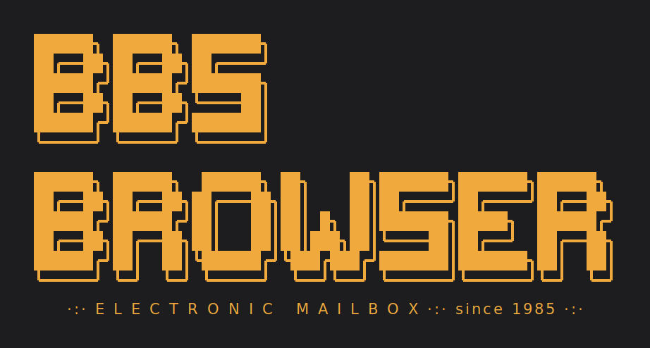
</p>

# BBS Browser 1985

Transforms the modern internet into a retro-BBS terminal: amber/green phosphor,
modem handshake, ASCII-art images, **BBS type components** an AI can lay a page
out with — and authentic BBS navigation feel with **numbered links**. For JS-heavy sites, a real Chromium renders in the background.

Plus an **AI SysOp**: an agent that uses the browser's capabilities as internal
tools. Summarizes pages, answers questions, navigates by description, chats — and
answers questions, navigates by description and chats. He also keeps the
**bulletin board**: while you dial in, he turns your news sources into the day's
headlines in board tone, merged by date — and for an RSS feed he isn't even needed.

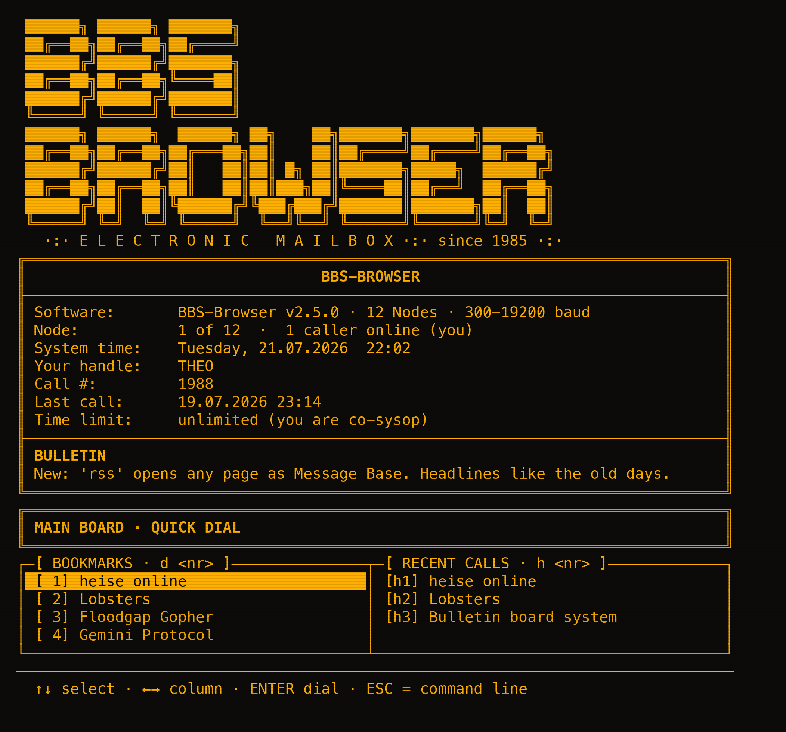

---

## Installation

```sh
curl -fsSL https://raw.githubusercontent.com/tesenwein/bbs-browser/main/install.sh | bash
```

The one-line installer fetches the latest release wheel from GitHub and sets up
the `bbs` command — preferably via `pipx`, otherwise in its own venv under
`~/.local/share/bbs-browser` with a symlink to `~/.local/bin`. Both methods
include the AI SDK; no `git` checkout needed, just `python3` and internet access.
Installation paths can be overridden via `BBS_PREFIX` and `BBS_BINDIR` environment
variables.

> Reading scripts from the internet before running them is good practice — the
> [`install.sh`](install.sh) is open in the repo.

**Windows** (PowerShell):

```powershell
iwr -useb https://raw.githubusercontent.com/tesenwein/bbs-browser/main/install.ps1 | iex
```

Does the same as `install.sh`: fetches the latest release wheel, sets up `bbs`
via `pipx` or its own venv under `%LOCALAPPDATA%\bbs-browser`. If Python is
missing, it's installed automatically via `winget`. Paths can be overridden
via `$env:BBS_PREFIX`; the script is open as [`install.ps1`](install.ps1).

From a local checkout, it works the same way:

```sh
make install                # recommended — works with or without pipx
```

Using `make` leverages `pipx` if available, otherwise creates its own venv under
`~/.local/share/bbs-browser` and links `bbs` to `~/.local/bin`. Both methods
include the AI SDK. Targets can be overridden with `PREFIX` and `BINDIR`.

Manual installation also works:

```sh
pipx install ".[ai]"        # requires pipx
```

> Plain `pip3 install .` fails on current distributions due to PEP 668
> (`externally-managed-environment`) — use `make install` or pipx instead.

Then: `bbs` or `bbs heise.de`. Without installation: `python3 -m bbs_browser`.

> `firecrawl-py` is a core dependency — the old `[firecrawl]` extra is empty
> and exists only to avoid breaking older installation instructions.

Additional Makefile targets:

```sh
make uninstall  # remove installation
make test       # offline tests
make build      # wheel + sdist to dist/
make run URL=heise.de   # run from dev environment (.venv)
make help       # all targets
```

### Command Line

```
bbs [url] [--fast] [--green] [--firecrawl] [--no-handshake]
          [--no-images] [--img-width N] [--lang en|de] [--links]
```

| Flag             | Effect                                                     |
| ---------------- | ---------------------------------------------------------- |
| `--fast`         | Disable typing effect — pages appear instantly             |
| `--green`        | Green instead of amber phosphor                            |
| `--firecrawl`    | Force Firecrawl for this session                           |
| `--no-handshake` | Skip modem dial-up, go straight to logo                    |
| `--no-images`    | No ASCII-art images                                        |
| `--img-width N`  | ASCII image width in characters (default 60)               |
| `--img-mode M`   | `ascii` (characters) or `blocks` (half-blocks, finer)      |
| `--lang en\|de`  | Language for this session                                  |
| `--links`        | Tool mode: output only the numbered link list              |

`bbs --links <url>` outputs the link list without terminal formatting — good
for scripts and pipes; exits with code 1 if the page is unreachable.

---

## The Dial-Up

Startup works like a real Hayes modem — `ATZ`, `OK`, dial tones,
`CARRIER`, protocol negotiation (LAP-M/V.42BIS), `CONNECT …/ARQ/V42BIS`, then
terminal detection (ANSI-BBS, CP437) and the ANSI logo. The reported baud rate
is what actually gets set (`c` → Display → Baud); at full speed, the era's fastest
modem reports **28800**.

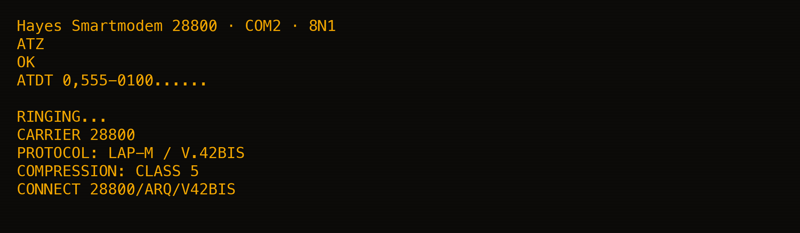

Next: **login**. On first run you register a handle, then password prompt and the
system screen with SysOp, software, node, system time, call number, last call — plus
the **bulletins** on the message board: with news sources configured they're
today's headlines in board tone (see [Bulletin Board](#bulletin-board)), otherwise
a rotating tip about the browser.

A password is optional (`c` → Password). If set, it's verified as PBKDF2-HMAC-SHA256
with 100,000 rounds and its own salt — **after three failed attempts the mailbox
hangs up**. Without a password, login shows the familiar screen of asterisks.

---

## Reading Pages

Every block is set at full screen width, in one column — a terminal is read in
one column, and text broken into two of them is harder to follow, not easier.
The top heading on each page renders as a **bold block poster
title** — short titles in the intro logo font (`ANSI Shadow`, via `pyfiglet`);
longer ones in a compact included block font; if that doesn't fit either, it
falls back to plain bold text. This applies to regular pages and AI-designed ones.
Links appear in text as `Link text[12]`: type the number, press Enter, done. Works
directly at the `-- MORE --` prompt too.

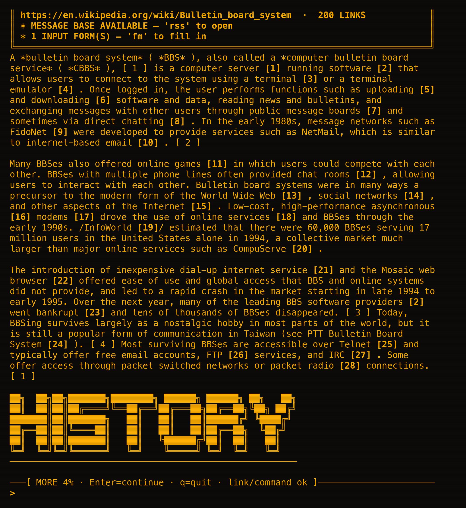

Real data tables get a CP437 frame with double line under the header; columns
automatically size (max 8 columns). The parser recognizes layout tables and
passes them through as flowing text.

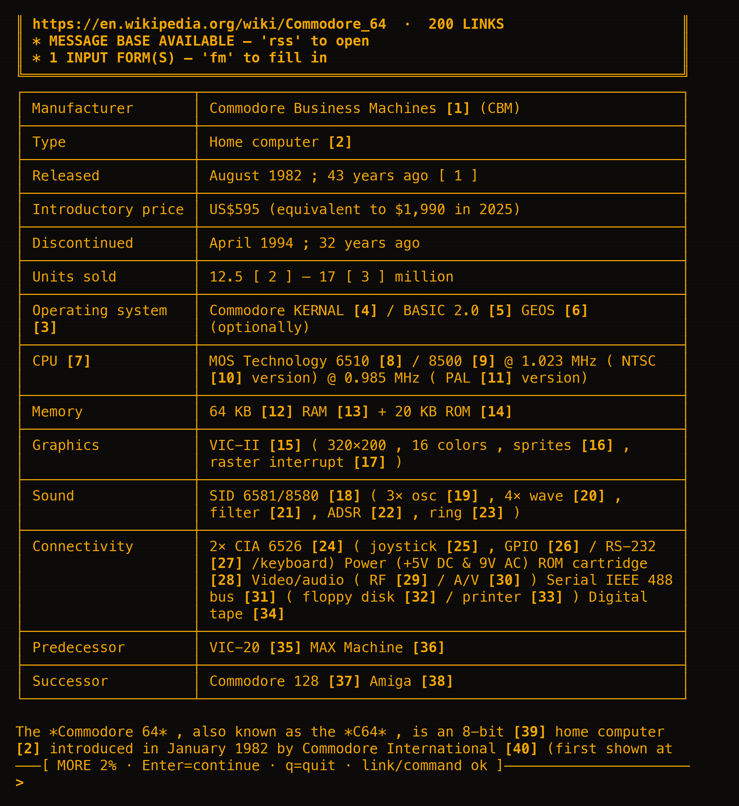

The **link table** (`l`, optionally filtered with `l ai`) shows all page links at a
glance — typing a number dials it directly.

Some things simply don't fit in a terminal — videos, maps, logins. `o` hands the
current page to the operating system's browser, `o 5` the target of link no. 5.
The handover goes through `wslview`, `xdg-open`, `open`, or `explorer.exe`,
whichever the system provides, so it works under WSL too.

### Input Forms

When the page includes a search field or filter bar, the header announces
`* 2 INPUT FORM(S) — 'fm' to fill`. `fm` opens the form (with multiple, choose via
`fm 2` for the second) and prompts field by field: empty input accepts the default,
choice lists are numbered. Submission is straightforward — the fields build the URL
and dial normally.

Only **`GET` forms** work, meaning searches and filters — the bulk of forms. Forms
with password or file fields and anything via `POST` stay off-limits — those need
a session. Forms in cookie banners and newsletter boxes are filtered out along with
their text, and duplicate searches across header, mobile, and sticky versions merge
into one.

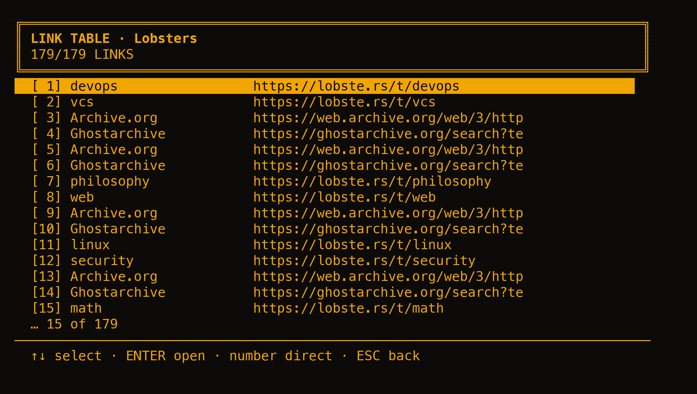

### What the Parser Can Also Do

- **ARIA-aware**: `aria-hidden`, `hidden` and `display:none` are stripped, along with
  landmark roles (navigation, banner, contentinfo, complementary …).
  `role=main`, `<main>`, or a single `<article>` becomes the content root;
  `aria-label` labels icon-only links.
- **Reading view with scoring**: pages without `<main>` and `<article>` get the
  Readability scorer. Each paragraph collects points by length and commas and passes
  them up to parents and grandparents; the highest-scoring container with low link
  density wins and becomes the content root. If no candidate convinces (under 400
  characters or under one-fifth of the page), the whole page stays — the scorer
  errs on the side of keeping content.
- **JS rendering**: if Playwright with Chromium is available, the browser fetches
  the page over a real Chromium — modern web builds content in the browser, a bare
  HTTP-GET often returns an empty shell. Chromium starts once and stays open until
  you hang up. If Playwright or the binary is missing, it continues without it
  (`requests`); `BBS_NO_JS=1` turns it off hard. When Firecrawl is enabled, it
  handles JS rendering completely — Playwright stays off, even if a Firecrawl
  request fails (then it falls back to `requests` directly and reports the error).
  Install with: `python3 -m playwright install chromium` — `up` and `make venv`
  handle that for you.
- **Cookie banners vanish**: over 100 known consent containers (OneTrust, TrustArc,
  Cookiebot, Osano, Complianz, Funding Choices …) and generic `cookie-consent`
  patterns are removed — **without accepting anything**; nothing gets clicked.
- **No-JS client with dignity**: `<noscript>` gets unpacked and displayed.
- **JSON-LD rescue**: if fewer than 200 characters of text remain on a JS-heavy
  page, the browser pulls `articleBody`/`description` from `ld+json`.
- **Meta-refresh** counts as a redirect (up to 3 jumps, max 10 s).
- **Usenet markup**: `*bold*` and `/italic/`.
- Character set is detected when the server doesn't send one.
- Limits: 200 links and 6 images per page, images up to 3 MB.

Images not worth keeping (logos, icons, tracking pixels, low-contrast areas, extreme
banner formats) are automatically skipped: under 100×60 px, aspect ratio over 6:1,
standard deviation under 18 — plus 15 keyword patterns in the URL.

---

## Commands

### Light Bar Menus

Every selection list — main menu, link table, bookmarks, game hall and the entire
config menu — uses the same light bar that ANSI mailboxes of the 90s (Renegade,
Mystic, Telegard) offered alongside hotkeys:

| Key | Effect |
| ----- | ------- |
| `↑` `↓` | Move bar (`Page ↑↓`, `Home`, `End` jump) |
| `←` `→` | Toggle value of highlighted row directly (color, baud, language, …) |
| `ENTER` | Open entry or toggle |
| Digit | Classic hotkey — continues to work unchanged |
| `X` | In bookmark menu: delete highlighted entry |
| `ESC` / `Q` | Back (in main menu: proceed to command line) |

A menu takes over the screen instead of appending at the bottom: clear once, draw
from line 1 — the bar stays put, history doesn't grow with each open menu.

Without a controllable terminal (pipe, CI, `BBS_NO_LIGHTBAR=1`) all menus
automatically fall back to pure numeric input.

| Command | Effect |
| ------ | ------- |
| `<nr>` | Dial link number — also at the `-- MORE --` prompt |
| `d <url>` | Dial page — also `gopher://` and `gemini://`; prompts if no argument |
| `d <nr>` | Shortcut: dial bookmark number |
| `s <text>` | Search via DuckDuckGo; prompts if no argument |
| `/word` | Search in page (`/` alone = continue search) |
| `b` / `f` | Back / Forward |
| `r` | Reload |
| `l [word]` | Link table: all links, optionally filtered — number dials |
| `n` / `n<nr>` | List nodes ("tabs") / switch — 4 lines, each with its own history |
| `fm [nr]` | Input form: fill in and submit the page's search field/filter |
| `rss [url]` | Message base: page's feed as BBS menu — or any feed |
| `bu [r]` | Bulletin board: your news sources merged by date (`r` = refresh now) |
| `we [r]` | Weather station: forecast for your configured place (`r` = refresh now) |
| `o [nr]` | Open in the real browser — current page or link target |
| `dl [nr]` | ZMODEM download to `~/bbs_downloads/` — page or link target |
| `a` | Save bookmark |
| `m` | Bookmark menu — number dials, `X` deletes highlighted entry |
| `home` | Return to main menu |
| `h [nr]` | Show history — with number dial directly |
| `i` / `t` | Toggle images / typing effect |
| `sv` / `matrix` | Start matrix rain now |
| `game [name]` | Game hall — `game paddle\|stacker\|snake\|bricks` starts directly |
| `dragon` | Door game 'The Ancient Wyrm' — also `game dragon` |
| `space` | Door game 'Star Courier' — also `game space` |
| `c` | **Config menu** |
| `fc` | Firecrawl check |
| `? [command]` | Help — `? rss` explains a command in detail |
| `up` | **Self-update** — fetch latest release from GitHub and reinstall `bbs` |
| `q` | Hang up (NO CARRIER) |

Plus AI commands `sum`, `ask`, `go`, `chat`, `w`, `p`, `x`, `ai` and `u` —
see [AI SysOp](#ai-sysop).

**Aliases:** `g`/`dial` for `d`, `search` for `s`, `summary` for `sum`,
`form` for `fm`, `games` for `game`. `paddle`, `stacker`,
`snake`, `bricks`, `dragon` and `space` also work without the `game` prefix.

**Keyboard:** At the `-- MORE --` prompt, `q` breaks the rest of the page. Ctrl+C
at input discards the line; **two in a row hang up** (`+++ATH` / `NO CARRIER`).
Ctrl+C mid-page-build jumps to the MORE prompt.

`?` takes over the screen and shows commands **grouped in framed categories** —
Navigation, Page & Content, Storage & History, AI SysOp, Game Hall, System &
Configuration. The overview runs through the pager (`-- MORE --`), no box gets
cut off, and the next command can go straight at the prompt.
`? <command>` explains a single command in detail.

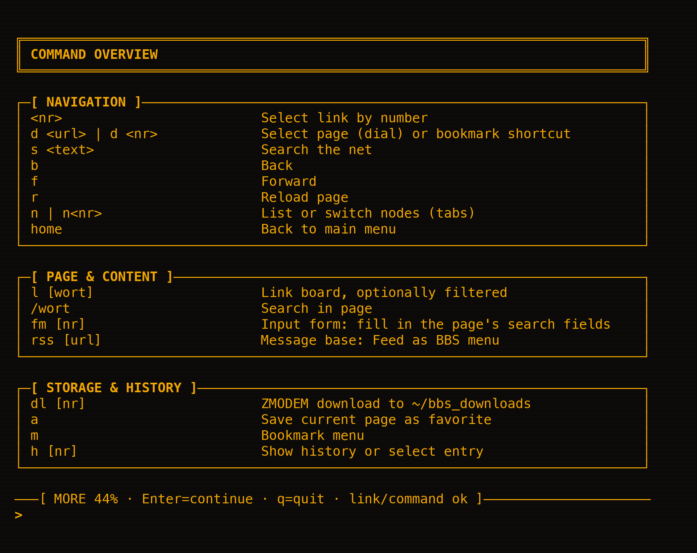

---

## Language

The entire interface comes in **English and German**. Switch via `--lang en|de`,
in the menu under `c` → Display → `8`, or permanently in the state file under
`ui.lang`. If a translation is missing, text falls back to English — nothing breaks.

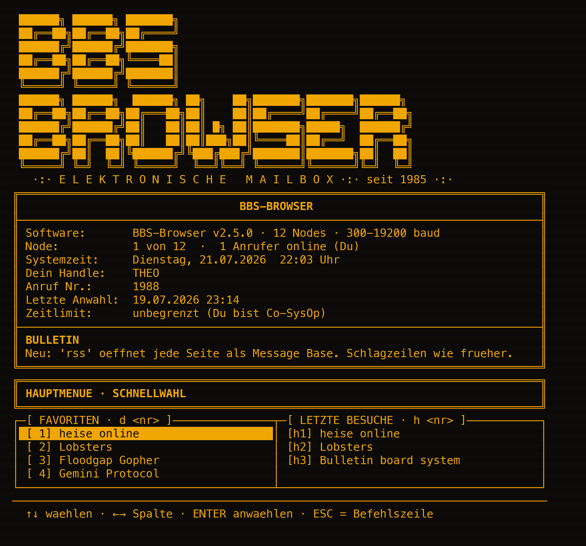

---

## Config Menu (`c`)

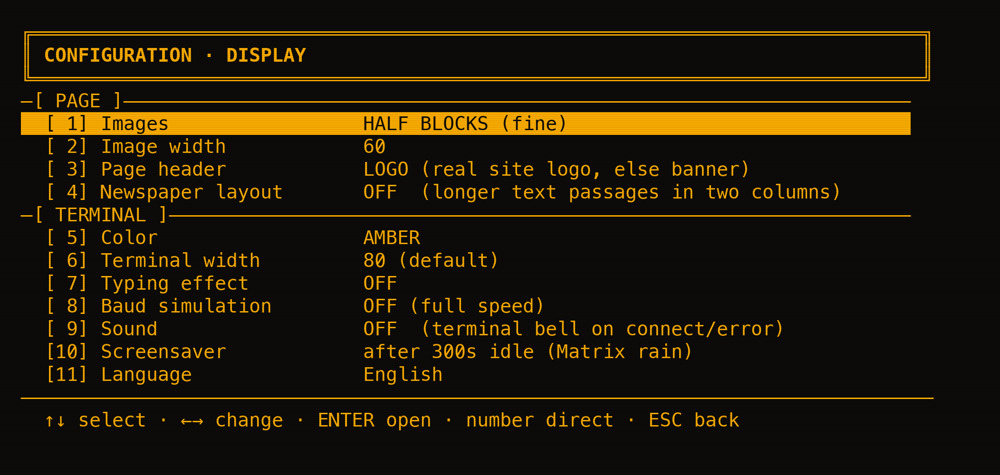

| Submenu             | Contents                                                     |
| ------------------- | ------------------------------------------------------------ |
| `1` AI SysOp        | Provider, key, model, default prompt, bulletins               |
| `2` Firecrawl       | on/off, mode (SDK or MCP), key, host, check                  |
| `3` Display         | see below                                                     |
| `4` Password        | Set, change, remove login password (empty input deletes)     |
| `5` Handle          | Change username                                              |
| `6` System access   | May the SysOp run shell commands? off / with prompt / freely, plus time limit |
| `7` MCP             | Register custom tool servers for the SysOp (bearer token or OAuth) |

Under **Display**: `1` Images, `2` Image width, `3` Page header, `4` Color,
`5` Terminal width (minimum 80, **takes effect after restart**), `6` Typing
effect, `7` Baud, `8` Sound, `9` Screensaver idle in seconds, `10` Language,
`11` Reset display settings.

**Smart color mode:** Color cycles through AMBER → GREEN → **AUTO** → **MULTI**.
In AUTO the browser tints the "screen" per page: from the page's `theme-color`
the nearest phosphor tone is chosen (amber, green, cyan, blue, magenta, red);
without a useful brand color, every domain gets its own stable color. MULTI
colors by role like a classic ANSI BBS instead: body copy gray, titles and link
markers yellow, frames and rules blue — and half-block images render in the
image's real colors instead of the phosphor tone.

**Baud simulation:** OFF → 2400 → 9600 (default: 9600). Pages stream in like through
a modem.

**Images:** Before converting to characters, autocontrast, gamma and an unsharp mask
run over the image; then Floyd-Steinberg dithering distributes quantization error
to neighboring pixels — creating intermediate tones that a character ramp doesn't
have by default. Under `12` there's `blocks` mode: instead of text characters it
uses half-blocks `▀` with separate foreground and background color, doubling the
vertical resolution — in the page's phosphor tone, so the CRT look stays.

**Page header:** If the page has a usable logo, it appears as ASCII art in the
header (toggleable under `13`) — in half-block mode (`12`) as colored half-blocks,
with double height resolution in the page's phosphor tone. The search starts in
the page head, then touch icons, largest size first; candidates are tried until
one reads clearly. The result lives in `~/.bbs_browser.db` under `logos`, so it
loads only once. If no logo is found — say it's only SVG — the domain gets one of
**50 hand-drawn ASCII banners** with its name on first visit — double frames, block
gradient fills, circuit board, cassette, 5¼-inch diskette, modem with status LEDs,
marquee with light bulbs, synthwave sun. Which motif belongs to which domain is
stored in `~/.bbs_browser.db` under `headers` — the page keeps its banner forever.
Costs nothing and needs no AI key. Toggle
under `10`; switching on asks if you want a new random banner for the current domain.
Terminals under 78 columns get no header rather than a torn one.

**Screensaver:** After `saver_idle` seconds without input (default 300, `0` disables),
matrix rain starts automatically; any key stops it. `sv` starts it immediately.

---

## Nostalgia

- **Main menu**: Without a start URL, a two-column board appears with
  favorites (`d <nr>` dials) and recent visits (`h <nr>`), plus status line and
  command bar — like a real BBS main board.
- **Sound**: Terminal bell on CONNECT and errors — and with sound on, the **real
  dial-up**: dial tone, DTMF tones of the phone number, ringback and the screech of
  carrier handshake. Everything is computed at runtime as PCM (8 kHz, no bundled
  sound files) and fed to the system's first available player (`paplay`, `aplay`,
  `pw-play`, `afplay`, PowerShell on Windows and WSL). If none is found, it stays
  silent.
- **ZMODEM downloads**: `dl` saves the page as text, `dl <nr>` the link target —
  with retro progress bars to the file area `~/bbs_downloads/`.
- **Nodes**: four lines like a mailbox with four modems, each with its own history —
  `n` lists, `n2` switches.

### Gopher & Gemini

`d gopher://gopher.floodgap.com` or `d gemini://geminiprotocol.net` — the
retro networks, native in the terminal. Gopher entry types are labeled inline
(TXT/DIR/SEARCH/WWW/GIF/IMAGE/BIN), type-7 searches run via `?query`. Gemini
follows up to 5 redirects and works by TOFU (no CA check).

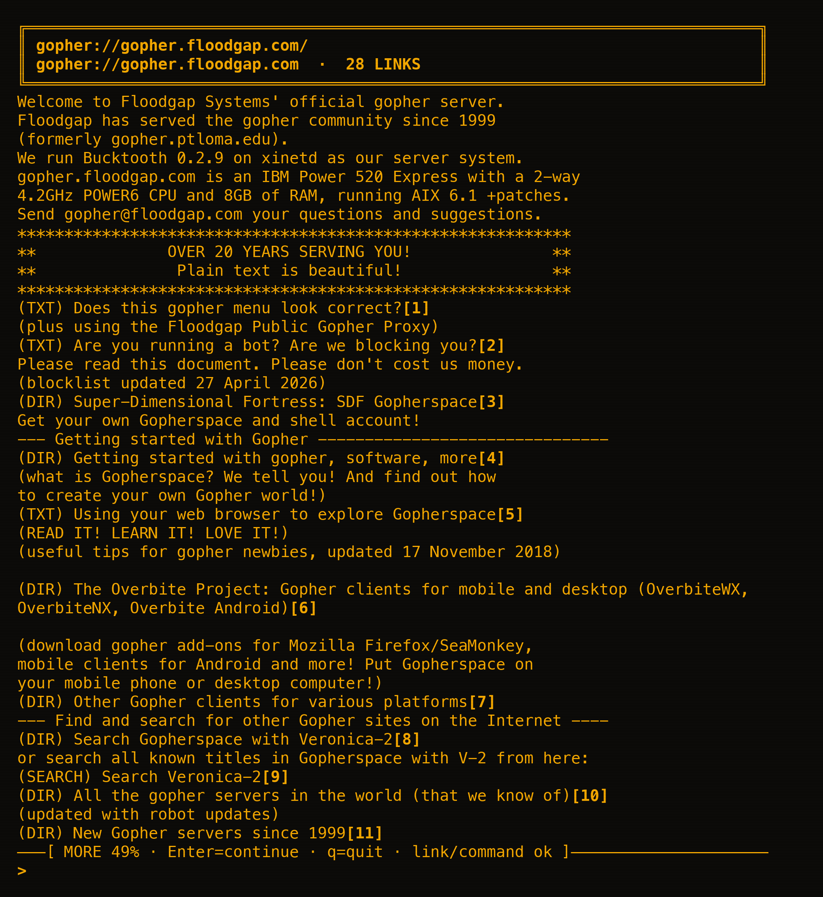

### Game Hall

`game` opens the game hall with **Paddle, Stacker, Snake and Bricks** — like
door games on a real mailbox. High scores live in `~/.bbs_browser.db`
under `games` and survive hangup.

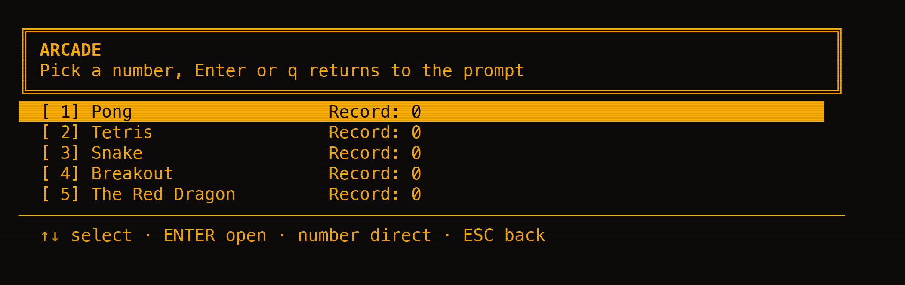

| Game         | Controls                                                           |
| ------------ | ------------------------------------------------------------------ |
| **Paddle**   | `w`/`s` or arrow keys, vs computer, first to 7                    |
| **Stacker**  | 10×20; `a`/`d` move, `w` rotate (with wall kick), `s` soft drop (+1/row), space hard drop (+2/row); level rises every 10 rows |
| **Snake**    | 29×17; `w`/`a`/`s`/`d`, each pellet 10 points, gets faster        |
| **Bricks**   | `a`/`d`, 3 lives, top rows worth more, +100 per remaining life     |

Arrow keys work in all games; `q` quits.

#### The Ancient Wyrm

`dragon` (also `game dragon`) opens the door game — a role-playing game
in the spirit of BBS classics, and the only game without raw terminal, so playable
through a pipe.

| Location          | What Happens There                                           |
| ------------------- | ------------------------------------------------------------ |
| **Forest**          | 15 fights per day; loot is gold and experience               |
| **Master**          | Enough experience? Then you fight for the next rank          |
| **Blacksmith**      | From bare fists to dragon slayer                             |
| **Armory**          | Linen shirt through dragon scales                            |
| **Tavern**          | Heal wounds, buy potions, store gold in chest                |
| **Wyrm's Lair**     | Rank 12+ — win and start over ennobled                       |

#### Star Courier

`space` (also `game space`) opens the trading door — twelve sectors on a
ring, each trade post with its own daily prices for ore, isotopes and
circuitry. Like the Wyrm it is a plain text door and works through a pipe.

| Station             | What Happens There                                           |
| ------------------- | ------------------------------------------------------------ |
| **Warp jump**       | 20 fuel per day; a jump costs its ring distance — pirates prowl the lanes |
| **Trade post**      | Buy low, warp, sell high; prices hold until midnight         |
| **Laser deck**      | From mining laser to sunsplitter                             |
| **Shield yard**     | Bare hull through null screen — shields also grow the hull   |
| **Station office**  | Repairs, nanokits, hold upgrades, the safe bank account      |
| **Wreck field**     | Sector 12 — from plasma battery up the Hollow Colossus waits |

In combat: `a` attack, `h` potion, `f` flee, `s` hero letter. Die and you wake up
next day — **without the gold you carried**; what's in the chest stays. In the
forest you might meet one of the AI callers from `w`: same personas, same handles,
only this time armed. The character lives in `~/.bbs_browser.db` under `dragon`
and survives hangup.

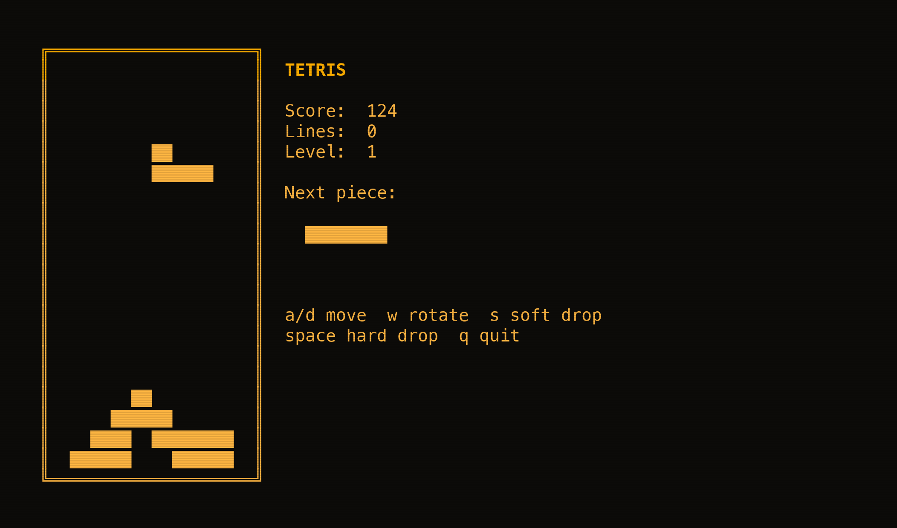

---

## AI SysOp

**Three providers to choose from** — you can switch anytime:

| Provider    | `ai provider …` | Key Prefix  | Environment           | Special Feature                        |
| ----------- | --------------- | ----------- | --------------------- | ---------------------------------- |
| Anthropic   | `anthropic`     | `sk-ant-…`  | `ANTHROPIC_API_KEY`   | Full capabilities including Firecrawl-MCP |
| Vercel      | `vercel`        | `vck_…`     | `AI_GATEWAY_API_KEY`  | Anthropic-compatible gateway, no MCP scrape |
| OpenAI      | `openai`        | `sk-…`      | `OPENAI_API_KEY`      | Own SDK, no MCP scrape                 |

Switch providers with `ai provider <name>` or in menu `c` → AI SysOp → `1`.
Each provider has its **own key**; register it with `ai key <key>`
(sets it for the active provider — a `vck_…`/`sk-ant-…` key auto-switches the
provider). `ai` shows which providers already have a key. Keys go to the system's
**keyring** (Gnome Keyring, KWallet, macOS Keychain, Windows Credential Locker) —
the database only has the marker `<keyring>`. Keys from older versions migrate
automatically on first run. If there's no usable keyring (headless Linux without
keyring service), the key stays in `~/.bbs_browser.db` as before — never in
the project.

Default model per provider: **Claude Haiku 4.5** (Anthropic), **DeepSeek V4
Flash** (Vercel) or **GPT-4o mini** (OpenAI); changeable via `ai model <name>`.
Cost estimation knows Haiku 4.5, Sonnet 4.6/5, Opus 4.8, DeepSeek V4 Flash and
GPT-4o / GPT-4o mini / GPT-4.1(-mini); unknown models are priced like Haiku.

**Default prompt:** Under `c` → AI SysOp → Default prompt you can store custom
additions (e.g., language, address, tone, length, favorite topics). They're
appended fresh to the system prompt with each SysOp answer (take effect immediately)
and **take priority** over the SysOp's standard defaults for language, tone, length
and focus; only the two house rules stay fixed (ASCII-only/no emoji and the 1985
role). `-` deletes them.

| Command     | Effect                                                |
| ----------- | ------------------------------------------------------ |
| `sum`       | Summarize page as SysOp digest                        |
| `ask <question>` | Ask SysOp about current page; prompts if no argument |
| `go <text>` | SysOp navigates to a matching link — if it looks like a URL, dials directly |
| `chat`      | Chat board: any number of SysOp conversations side by side — lightbar list with titles, `n` new / `x` delete, AI names each thread after the first exchange; `chat new` starts fresh, `chat <nr>` continues a thread from `log`, in-chat `/new`, `/chats`, `/name <title>` |
| `log`       | Saved chat threads — `log <nr>` reads, `chat <nr>` continues, `log del <nr>` and `log clear` delete |
| `w`         | Who's online — list of AI callers with node, handle, baud rate, idle time |
| `p <nr>`    | Private chat with caller `<nr>` — persona from 1989, history per handle |
| `x`         | Set/reset the domain's house template, `x -` melts it down (see [Style Templates](#style-templates)) |
| `ai`        | Status / provider / key / model (`ai provider <name>` to switch) |
| `u`         | Token usage & estimated costs (`u reset` zeros it) |

The agent has ten tools: read page, list links, follow link, dial, search,
Firecrawl scrape, **read on web** and **search web** (both in background, without
changing your screen) plus two handbook tools to explain any browser feature.
`chat` pushes the current page once as context and refreshes it when you scroll;
each thread keeps the last 20 exchanges. Conversations live side by side like
threads on a message base: the board (`chat`) lists them with title, line count
and last activity, and an untitled thread is named by the AI after the first
exchange — like any modern chat client, just with more phosphor.

### Style Templates

`x` has the SysOp set ONE house template for the current domain — and that
template is then applied to every further page of that domain without any AI
call at all.

Setting it is not a blind shot. The SysOp gets the page's blueprint (tags with
classes/IDs and how many characters hang below each, never the text itself) and
three tools from the print shop: `satzprobe` takes a type sample off a CSS
selector, `bauplan` digs into a subtree, and `andruck` proofs the current draft
and reports what came off the press. It corrects itself until the draft holds.

The draft is proofed across galleys, not just the one it was written on: up to
three further links of the same domain are fetched — over the same line the
browser dials with, Firecrawl and Playwright included, so a JS-heavy site is
learned from the document that actually reaches the screen. `andruck` then
measures the draft's character balance against the hand-set baseline on ALL of
them. A selector that only matches on galley 1 never survives that.

**The work is the titles and the large bodies of text, and no content may be
lost doing it.** `banner`, `heading`, `rule` and `frame` collapse the whole
matched element into a single block, so each carries a character ceiling —
120 for a poster title, 200 for a heading, 120 for a rule, 900 for a framed
lead. Aimed at a container instead of a title, the mark is refused outright and
the element keeps running through the normal heuristics; a `drop` taking more
than a quarter of the page's text with it is refused the same way. The proof
prints those refusals as `REFUSED`, so the SysOp sees exactly where it grabbed
a container.

**Pictures count as content too.** A mark aimed at an element that carries an
image is refused outright — collapsing it into one text block would pulp the
picture — and the proof reports per galley how many cuts survived; a draft
losing more than half of them fails. Images are tallied even though the
learning builds run without fetching them, so a template cannot quietly clear
the page of every picture and still pass. All of this is enforced at the press,
not just asked for in the prompt: a template can restyle titles, it cannot make
body copy or pictures disappear.

The finished template maps the site's recurring building blocks to the
renderer's **type case** — the fixed set of BBS graphic components the
renderer can actually set. The SysOp picks from it, it cannot invent one:

| Component  | What it sets |
|------------|--------------|
| `banner`   | Poster title in block lettering (`ANSI Shadow`), with an underline |
| `heading`  | Bold heading with a rule under it |
| `topicbar` | Section bar with the title set into the rule: `──═[ SECTION ]═────` |
| `ticker`   | Dimmed one-liner between arrows: `>>> DATELINE · BYLINE <<<` |
| `plaque`   | Single-line box with a drop shadow — the sign nailed up for a key statement |
| `notice`   | Callout on a solid left bar with a bang — warnings, editor's notes |
| `frame`    | Double-line ANSI box — the lead |
| `infobox`  | Key/value box from a table or `<dl>` |
| `rule`     | Divider line |
| `quote`    | Indented quotation block |
| `pre`      | Code/preformatted, untouched |
| `text`     | Body copy at full screen width |

Plus a content root and a noise list. It lives in the database under the domain
and is applied to every page of that domain. Before it is applied, its own
selectors are counted against the page: find too few of them and the page falls
back to hand-set type instead of being torn apart. Dialing a page that a
template actually took hold on says so:
`*** SYS 0x22: HOUSE TEMPLATE heise.de IN THE FORME`; a page it found no hold on
says `!!! ERR 25: ... FINDS NO HOLD ON THIS GALLEY`.

Another `x` resets the template, `x -` melts it down. Under `c` → AI SysOp →
House templates you see every domain in the type case, can melt one or all of
them, and can switch on **Set automatically** — then the first visit to a
domain without a template sets one on its own. That switch is off by default:
setting costs AI calls, and that shouldn't happen behind your back. Without an
AI key, `x` isn't available (set one under `c` → AI SysOp). Search results,
RSS, bulletins, weather, Gopher/Gemini and internal screens carry no HTML
document and get no template.

### Bulletin Board

A real board greeted its callers with the SysOp's bulletins. Here the SysOp writes
them himself: give him one or more **news sources** under `c` → Bulletins →
News sources (RSS feeds or plain news pages — for a page the browser
looks up the feed it declares), and during the next dial-up he boils their
headlines down to a handful of one-liners in board tone.

**An RSS or Atom feed needs no AI at all**: a feed entry already is one clean
headline, so it becomes a bulletin as it stands — source, board and all, with no
key and no cost. Only a plain news page has to be read by the SysOp, who digs the
headlines out of the link soup and rewrites them; that one needs a key.

**Several sources become one board.** Add as many as you like (up to 8) and mix
feeds and pages freely: every source is normalised to the same kind of entry and
the lot is merged into **one timeline, newest first**, with duplicates dropped —
a wire story carried by two feeds appears once. Each line carries where it came
from and how old it is (`heise.de · 10 min ago`). Headlines from a plain page
carry no date at all, so they follow the dated ones rather than being stamped
with the fetch time and outranking real dates. In the sources list, `ENTER`
switches a source off without losing it, `a` adds one and `x` throws it out.

It happens **in a background thread while you're logging in** — the typing effect of
the dial-in sequence is exactly the time it needs, so nothing waits. The result
lives in the database with a timestamp and is reused for **6 hours** by default;
the cadence (0–72 h, **0 = every dial-up**) and the number of bulletins (1–12) are
yours to set. `--fast` skips the whole generation and keeps the stored bulletins —
there's no dial-up sequence to hide the wait behind.

The freshest bulletins replace the built-in tips in the **welcome box**, and the
main board gains a `BULLETIN BOARD` entry above the two registers. `bu` opens the
full list, each bulletin with the `[n]` link to the original article — so the board
is a real entry point into the day's news, not just a note. `bu r` forces an
immediate refresh. Without a source — or without a key on a non-feed source —
nothing changes: the familiar rotating tips stay.

### Weather Station

A real SysOp's desk had a row of clocks for the other continents and a
bulletin with the local forecast — the board keeps both. Set a place under
`c` → Weather Station (geocoded via Open-Meteo, no key needed), and `we`
shows current conditions plus a 4-day outlook. The forecast is cached for
30 minutes so paging back and forth doesn't hammer the service; `we r` forces
a refresh. World clocks for other cities can be added in the same menu.

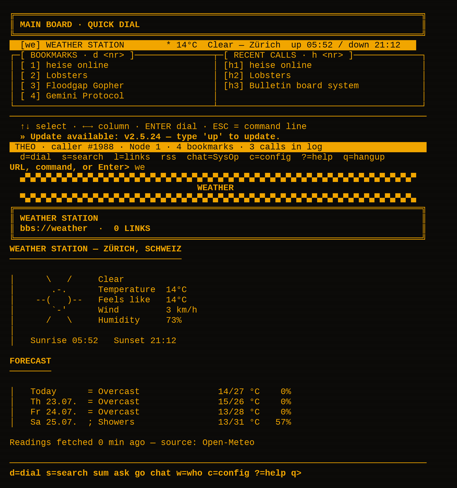

### Other Callers

With a key registered, the mailbox isn't empty: `w` shows who else is online,
`p <nr>` opens a private chat. The personas are from 1989, grow across sessions
up to 20, and 3–8 are "online" per session. Each chat thread is saved per handle
(last 20 messages); `exit`, `quit`, `q` or an empty line ends it.

Occasionally someone knocks on their own (`CHAT REQUEST from <handle>`,
answer `j`/`y`) — at most every 240 seconds and 5% chance per input. Accept and
the caller opens chat themselves with a first line in character. Without a key,
`w` and `p` stay silent.

### Rendering of AI Output

All AI text (SysOp chat, bulletins, ANSI art descriptions) comes back as
**Markdown** and is rendered with [rich](https://github.com/Textualize/rich) in the
terminal's phosphor tone. Block titles use
[`pyfiglet`](https://pypi.org/project/pyfiglet/) — a **core dependency**, so poster
titles come in the intro font **even without** the `[ai]` extra. If a title doesn't
fit even wrapped, it falls back to plain bold text. If `rich` is missing (only in
the `[ai]` extra), AI text comes through plain but styled.

**Install the AI SDK** — already included in `make install`. Only needed if you
installed manually without the `[ai]` extra:

```sh
pipx inject bbs-browser anthropic openai rich
```

Then choose a provider and register the API key:

```
Command> ai provider openai       (or anthropic / vercel)
Command> ai key sk-...            (sk-ant-… or vck_… auto-switches provider)
```

or via menu: `c` → AI SysOp → `1` switches provider, `2` enters key. Check with
`ai` — it must show "ONLINE" and the active provider. Keys go to the system keyring,
not the project.

---

## Firecrawl (JS-Heavy Pages)

Configurable in the config menu (`c` → Firecrawl):

- **SDK direct**: Firecrawl key (`fc-…`, or `FIRECRAWL_API_KEY` from environment),
  optionally your own host (self-hosting, e.g., `http://my-server:3002` — key
  optional when self-hosting).
- **MCP via AI**: the SysOp loads Firecrawl as an MCP server via the Claude MCP
  connector (cloud: `mcp.firecrawl.dev` with your fc-key, or your own hosted MCP
  URL in the host field). If a page delivers too little text, the SysOp auto-scrapes —
  this only works in MCP mode.

Use `fc` (or menu `c` → Firecrawl → `5`) for the **Firecrawl check**, which
validates config and connection without spending credits: mode, SDK/key present,
MCP-capable AI key, host or cloud reachable, key valid (including credit balance).

---

## What Gets Stored Where

Everything lives in a single SQLite database: `~/.bbs_browser.db`. If you had JSON
files before, you don't need to do anything — on first run their content migrates
one-time into the database; the old files stay untouched.

Settings and state live in the `sections` table, each section as a JSON blob:

| Section      | Contents                                                          |
| ------------ | ----------------------------------------------------------------- |
| `nav`        | Favorites and history (last 100 entries)                          |
| `ai`         | API key and model                                                 |
| `firecrawl`  | on/off, MCP mode, key, host                                       |
| `ui`         | Language, color, typing effect, baud, sound, images, image width, welcome type, screensaver idle, terminal width |
| `profile`    | Handle, password hash and salt, call counter, last call           |
| `usage`      | Tokens and estimated costs over lifetime                          |
| `games`      | High scores per game                                              |
| `users`      | AI caller personas                                                |
| `bulletins`  | News source, refresh cadence, number of bulletins                 |
| `bulletins_cache` | The generated bulletins with source and timestamp            |

Plus two more tables: `design` with cached ANSI art (7 days) and `chat_log` with
**all conversations** — SysOp chat and every
private chat with a caller, per channel the last 400 lines. History outlasts hangup:
the SysOp remembers next call, and `log` shows old threads (`log <nr>` reads,
`log del <nr>` and `log clear` delete).

The file contains more than just settings — **API key, password hash and chat
threads** live there. It stays in your home directory, never in the project, and is
listed in `.gitignore`.

---

## Development

```sh
make test                        # offline tests (pytest)
python3 tools/shots.py           # rebuild screenshots (needs pyte + Pillow)
python3 tools/shots.py 03-page   # just one scene
python3 tools/make_logo.py       # rebuild assets/ (needs cairosvg + Pillow)
```

**Brand assets:** the wordmark lives as ANSI-Shadow block letters in
`bbs_browser/wordmark.py` — the single source for both the logo the terminal
prints at logon and the vector artwork in `assets/`. `tools/make_logo.py` turns
the full block into a filled rectangle and the frame characters behind it into
the drop shadow, writing `logo.svg` and the square `icon.svg`, then rasterizes
`logo.png`, `icon.png`, `icon-256.png` and a multi-size `icon.ico` from the SVG,
so vector and bitmap can never drift apart. Change a glyph once and every
rendering follows.

`tools/shots.py` runs the browser in a pseudo-terminal, emulates the screen with
`pyte` and renders it with Pillow as PNG — with fresh, temporary HOME so real user
data never ends up in a screenshot. Rendered in a fixed character grid with the
first available monospace font supporting frames and block graphics (Menlo, DejaVu
Sans Mono, Liberation Mono, FreeMono) — the list lives in `FONT_CANDIDATES`.

## License

MIT — see [LICENSE](LICENSE).
